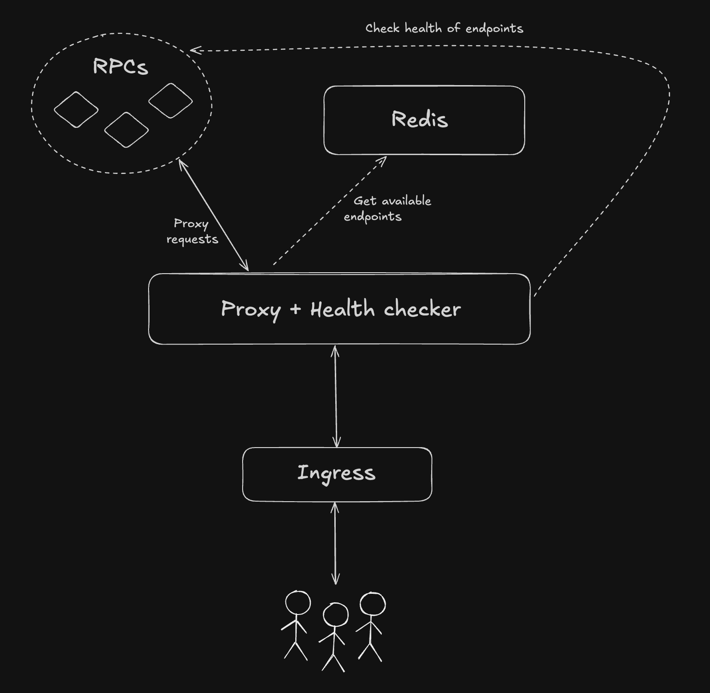

# Ætherlay - RPC Load Balancer

A lightweight, low-latency RPC load balancer written in Go. It is designed to manage and distribute requests to multiple upstream RPC endpoints based on their health status and request counts. The load balancer supports health checks and utilizes Valkey for state management.

## Features

- **Round-Robin Load Balancing**: Distributes requests to available endpoints in a round-robin manner, prioritizing those with fewer requests in the last 24 hours.
- **Intelligent Retry Logic**: Configurable retry attempts with priority-based endpoint selection (primary endpoints, fallbacks, and optional public-first mode).
- **Public-First Mode**: Optional prioritization of public RPC endpoints to reduce costs while maintaining reliability.
- **Flexible Timeout Control**: Separate timeouts for overall requests and individual retry attempts.
- **Rate Limit Recovery**: Safe rate limit detection and recovery with exponential backoff strategies per endpoint, to avoid making things worse when a provider is rate-limiting you.
- **Health Checks**: Regularly checks the health of upstream endpoints and updates their status in Valkey.
- **Standalone Health Checker**: Optional standalone health checker service for efficient multi-pod deployments.
- **Static Configuration**: Loads RPC endpoint configurations from a static JSON file.
- **Multi-threaded**: Capable of handling multiple requests concurrently.
- **Kubernetes Ready**: Designed to run in a Kubernetes environment with Horizontal Pod Autoscaling (HPA) enabled.
- **WebSocket Support**: Full WebSocket proxy support for real-time applications.

## Setup Instructions

### Option 1: Integrated Health Checks

1. **Clone the Repository**:

   ```
   git clone https://github.com/project-aethermesh/aetherlay
   cd aetherlay
   ```

2. **Install Dependencies**:

   ```
   go mod tidy
   ```

3. **Configure Endpoints**:
   Rename the `configs/endpoints-example.json` file to `configs/endpoints.json` and modify it as required in order to add all the RPC endpoints you want to load balance with this tool.

4. **Set up your .env file**:
   Copy the `.env.example` file to `.env` and modify it as required:

   ```bash
   cp .env.example .env
   ```

   Edit the `.env` file to add your API keys and configuration. For running a single service with both the health check and load balancer, make sure to set `STANDALONE_HEALTH_CHECKS=false`.

5. **Run the Application**:
   ```
   make run-lb
   ```

### Option 2: Standalone Health Checker

1. **Clone the Repository**:

   ```
   git clone https://github.com/project-aethermesh/aetherlay
   cd aetherlay
   ```

2. **Install Dependencies**:

   ```
   go mod tidy
   ```

3. **Configure Endpoints**:
   Rename the `configs/endpoints-example.json` file to `configs/endpoints.json` and modify it as required in order to add all the RPC endpoints you want to load balance with this tool.

4. **Set up your .env file**:
   Copy the `.env.example` file to `.env` and modify it as required:

   ```bash
   cp .env.example .env
   ```

   Edit the `.env` file to add your API keys and configuration.

5. **Build and run both services in the background**:
   ```bash
   make run
   ```

### Option 3: Deploy to Kubernetes

Basic YAML files are provided for deploying to Kubernetes. It's recommended to check them out and update them as required. After that's done, simply run:

```bash
make k8s-deploy
```

## Usage

The load balancer will listen for incoming requests on predefined endpoints that match the configured chains (e.g., `/mainnet`, `/base`, `/optimism`). It will proxy these requests to the available upstream endpoints based on their health status and request counts.

### Available Endpoints

- `GET /health` - Health check endpoint for the load balancer
- `GET /{chain}` - WebSocket upgrade requests for a specific chain
- `POST /{chain}` - HTTP RPC requests for a specific chain

### Query Parameters

- `?archive=true` - Request archive node endpoints only

## Retry and Timeout Behavior

The load balancer implements intelligent retry logic with configurable timeouts:

### How Retries Work

1. **Priority-based selection**: Endpoint selection follows these priorities:
   - **Normal mode**: primary → fallback → public
   - **Public-first mode** (`PUBLIC_FIRST=true`): public → primary → fallback
2. **Configurable attempts**: Retries up to `PROXY_MAX_RETRIES` times.
3. **Public endpoint limiting**: When `PUBLIC_FIRST=true`, attempts to reach public endpoints are limited to the value of `PUBLIC_FIRST_ATTEMPTS`, after which the proxy tries using a primary or fallback endpoint.
4. **Endpoint rotation**: Removes failed endpoints from the retry pool to avoid repeated failures.
5. **Dual timeout control**: There are 2 settings that control how long requests take:
   - **Total request timeout** (`PROXY_TIMEOUT`): Maximum time for the entire request (this is what the end user "sees").
   - **Per-try timeout** (`PROXY_TIMEOUT_PER_TRY`): Maximum time per individual request sent from the proxy to each endpoint.

### Benefits

- **Fast failover**: Won't wait the whole `PROXY_TIMEOUT` on a single sluggish endpoint.
- **Improved responsiveness**: Each endpoint gets, at most, `PROXY_TIMEOUT_PER_TRY` seconds to respond.
- **More success opportunities**: This allows you to use a `PROXY_MAX_RETRIES` that's greater than `PROXY_TIMEOUT`/`PROXY_TIMEOUT_PER_TRY`, since failures can happen way before `PROXY_TIMEOUT_PER_TRY` is reached.

## Configuration

### Command Line Flags

| Flag                                   | Default                                                         | Description                                                                                                                                                             |
| -------------------------------------- | --------------------------------------------------------------- | ----------------------------------------------------------------------------------------------------------------------------------------------------------------------- |
| `--config-file`                        | `configs/endpoints.json`                                        | Path to endpoints configuration file                                                                                                                                    |
| `--cors-headers`                       | `Accept, Authorization, Content-Type, Origin, X-Requested-With` | Allowed headers for CORS requests                                                                                                                                       |
| `--cors-methods`                       | `GET, POST, OPTIONS`                                            | Allowed HTTP methods for CORS requests                                                                                                                                  |
| `--cors-origin`                        | `*`                                                             | Allowed origin for CORS requests                                                                                                                                        |
| `--ephemeral-checks-healthy-threshold` | `3`                                                             | Amount of consecutive successful responses required to consider endpoint healthy again                                                                                  |
| `--ephemeral-checks-interval`          | `30`                                                            | Interval in seconds for ephemeral health checks                                                                                                                         |
| `--health-check-interval`              | `30`                                                            | Health check interval in seconds                                                                                                                                        |
| `--health-check-sync-status`           | `true`                                                          | Consider the sync status of the endpoints when deciding whether an endpoint is healthy or not. When enabled, endpoints that are syncing are considered to be unhealthy. |
| `--log-level`                          | `info`                                                          | Set the log level. Valid options are: `debug`, `info`, `warn`, `error`, `fatal`, `panic`                                                                                |
| `--metrics-enabled`                    | `true`                                                          | Whether to enable Prometheus metrics                                                                                                                                    |
| `--metrics-port`                       | `9090`                                                          | Port for the Prometheus metrics server                                                                                                                                  |
| `--proxy-retries`                      | `3`                                                             | Maximum number of retries for proxy requests                                                                                                                            |
| `--proxy-timeout`                      | `15`                                                            | Total timeout for proxy requests in seconds                                                                                                                             |
| `--proxy-timeout-per-try`              | `5`                                                             | Timeout per individual retry attempt in seconds                                                                                                                         |
| `--public-first`                       | `false`                                                         | Prioritize public endpoints over primary endpoints                                                                                                                      |
| `--public-first-attempts`              | `2`                                                             | Number of attempts to make at public endpoints before trying primary/fallback                                                                                           |
| `--valkey-host`                        | `localhost`                                                     | Valkey server hostname                                                                                                                                                   |
| `--valkey-pass`                        | -                                                               | Valkey server password                                                                                                                                                   |
| `--valkey-port`                        | `6379`                                                          | Valkey server port                                                                                                                                                       |
| `--valkey-skip-tls-check`              | `false`                                                         | Whether to skip TLS certificate validation when connecting to Valkey                                                                                                     |
| `--valkey-use-tls`                     | `false`                                                         | Whether to use TLS for connecting to Valkey                                                                                                                              |
| `--server-port`                        | `8080`                                                          | Port to use for the load balancer / proxy                                                                                                                               |
| `--standalone-health-checks`           | `true`                                                          | Enable standalone health checks                                                                                                                                         |

> **Note:** Command-line flags take precedence over environment variables if both are set.

### Environment Variables

| Variable                             | Default                                                         | Description                                                                                                                                                                       |
| ------------------------------------ | --------------------------------------------------------------- | --------------------------------------------------------------------------------------------------------------------------------------------------------------------------------- |
| `ALCHEMY_API_KEY`                    | -                                                               | Example API key for Alchemy RPC endpoints. **Only needed for the example config.** The name must match the variable referenced in your `configs/endpoints.json`, if you need any. |
| `INFURA_API_KEY`                     | -                                                               | Example API key for Infura RPC endpoints. **Only needed for the example config.** The name must match the variable referenced in your `configs/endpoints.json`, if you need any.  |
| `CONFIG_FILE`                        | `configs/endpoints.json`                                        | Path to the endpoints configuration file                                                                                                                                          |
| `CORS_HEADERS`                       | `Accept, Authorization, Content-Type, Origin, X-Requested-With` | Allowed headers for CORS requests                                                                                                                                                 |
| `CORS_METHODS`                       | `GET, POST, OPTIONS`                                            | Allowed HTTP methods for CORS requests                                                                                                                                            |
| `CORS_ORIGIN`                        | `*`                                                             | Allowed origin for CORS requests                                                                                                                                                  |
| `EPHEMERAL_CHECKS_HEALTHY_THRESHOLD` | `3`                                                             | Amount of consecutive successful responses from the endpoint required to consider it as being healthy again                                                                       |
| `EPHEMERAL_CHECKS_INTERVAL`          | `30`                                                            | Interval in seconds for ephemeral health checks                                                                                                                                   |
| `HEALTH_CHECK_INTERVAL`              | `30`                                                            | Health check interval in seconds                                                                                                                                                  |
| `HEALTH_CHECK_SYNC_STATUS`           | `true`                                                          | Consider the sync status of the endpoints when deciding whether an endpoint is healthy or not. When enabled, endpoints that are syncing are considered to be unhealthy.           |
| `LOG_LEVEL`                          | `info`                                                          | Set the log level                                                                                                                                                                 |
| `METRICS_ENABLED`                    | `true`                                                          | Whether to enable Prometheus metrics                                                                                                                                              |
| `METRICS_PORT`                       | `9090`                                                          | Port for the Prometheus metrics server                                                                                                                                            |
| `PROXY_MAX_RETRIES`                  | `3`                                                             | Maximum number of retries for proxy requests                                                                                                                                      |
| `PROXY_TIMEOUT`                      | `15`                                                            | Total timeout for proxy requests in seconds                                                                                                                                       |
| `PROXY_TIMEOUT_PER_TRY`              | `5`                                                             | Timeout per individual retry attempt in seconds                                                                                                                                   |
| `PUBLIC_FIRST`                       | `false`                                                         | Prioritize public endpoints over primary and fallback endpoints                                                                                                                   |
| `PUBLIC_FIRST_ATTEMPTS`              | `2`                                                             | Number of attempts to make at public endpoints before trying with a primary/fallback                                                                                              |
| `VALKEY_HOST`                        | `localhost`                                                     | Valkey server hostname                                                                                                                                                             |
| `VALKEY_PASS`                        | -                                                               | Valkey server password                                                                                                                                                             |
| `VALKEY_PORT`                        | `6379`                                                          | Valkey server port                                                                                                                                                                 |
| `VALKEY_SKIP_TLS_CHECK`              | `false`                                                         | Whether to skip TLS certificate validation when connecting to Valkey                                                                                                               |
| `VALKEY_USE_TLS`                     | `false`                                                         | Whether to use TLS for connecting to Valkey                                                                                                                                        |
| `SERVER_PORT`                        | `8080`                                                          | Port to use for the load balancer / proxy                                                                                                                                         |
| `STANDALONE_HEALTH_CHECKS`           | `true`                                                          | Enable/disable the standalone mode of the health checker                                                                                                                          |

## Health Check Configuration

The service checks the health of an endpoint by sending these requests to it:

- `eth_blockNumber` - Checks for successful response and that the block is not `0`.
- `eth_syncing` (unless you disable it by setting `HEALTH_CHECK_SYNC_STATUS=false`) - Checks for successful response and that the node is not syncing (i.e., it has already fully synced, so you get the latest data from it).

### Integrated Health Checks

When `STANDALONE_HEALTH_CHECKS=false`, the load balancer will run integrated health checks using the `HEALTH_CHECK_INTERVAL` setting.

You can also disable health checks altogether by setting `HEALTH_CHECK_INTERVAL` to `0`, which might affect the performance of the proxy but will prevent the service from wasting your RPC credits by constantly running health checks. In this case, health checks will be run in an ephemeral fashion. For example:

1. A user sends a request.
2. The LB tries to proxy that request to RPC endpoint "A" but fails.
3. 3 things happen at the same time:
   I. The RPC endpoint "A" is marked as unhealthy.
   II. The LB tries to proxy that request to another RPC endpoint.
   III. An ephemeral health checker starts running to monitor RPC endpoint "A" at the interval specified by `EPHEMERAL_CHECKS_INTERVAL` (default: 30s).
4. As soon as RPC endpoint "A" is healthy again, the ephemeral health checker is stopped.

#### Ephemeral Health Checks

- **Trigger**: Only when a request to an endpoint fails and health checks are otherwise disabled. The server marks the endpoint as unhealthy for the specific protocol (HTTP or WS) that failed.
- **Interval**: Controlled by the `EPHEMERAL_CHECKS_INTERVAL` environment variable (in seconds).
- **Behavior**: The health checker service observes the unhealthy status and starts ephemeral checks for the affected protocol. The system will monitor the failed endpoint at the specified interval and automatically start routing traffic to it as soon as it becomes healthy again.

#### Per-Protocol Unhealthy Marking

- When a request to an endpoint fails (HTTP or WebSocket), the server marks that endpoint as unhealthy for the specific protocol that failed (e.g., `HealthyHTTP = false` or `HealthyWS = false` in Valkey).
- The health checker service detects this change and starts ephemeral health checks for that protocol only.
- Once the endpoint passes the configured number of consecutive health checks, it is marked healthy again and ephemeral checks stop.

### Standalone Health Checker (Recommended)

For production deployments with multiple load balancer pods, use the standalone health checker:

- **Single Health Checker Instance**: Prevents duplicate health checks
- **Multiple Load Balancer Pods**: Scale independently without health check overhead
- **Resource Efficiency**: Reduces RPC endpoint usage
- **Better Separation of Concerns**: Health monitoring isolated from request handling

## Public-First Mode

Ætherlay supports a "public-first" mode that prioritizes public RPC endpoints over primary and fallback endpoints to help reduce costs while maintaining reliability.

### How Public-First Mode Works

1. **Enable public-first**: Set `PUBLIC_FIRST=true` (or use the `--public-first` CLI flag)
2. **Configure attempts**: Set `PUBLIC_FIRST_ATTEMPTS` to control how many public endpoints to try (default: 2)
3. **Endpoint hierarchy**:
   - **When enabled**: public → primary → fallback
   - **When disabled**: primary → fallback → public

### Configuration Example

In your `endpoints.json`, mark endpoints with `"role": "public"`:

```json
{
  "mainnet": {
    "publicnode-1": {
      "provider": "publicnode",
      "role": "public",
      "type": "archive",
      "http_url": "https://ethereum-rpc.publicnode.com",
      "ws_url": "wss://ethereum-rpc.publicnode.com"
    },
    "alchemy-1": {
      "provider": "alchemy",
      "role": "primary",
      "type": "archive",
      "http_url": "https://eth-mainnet.g.alchemy.com/v2/${ALCHEMY_API_KEY}"
    }
  }
}
```

## Rate Limit Recovery

Ætherlay includes intelligent rate limit detection and recovery mechanisms to handle upstream provider rate limits gracefully. This system automatically detects when endpoints are rate-limited and implements recovery strategies to restore service.

### How Rate Limit Recovery Works

1. **Detection**: When a request returns a rate limit error (HTTP 429), the endpoint is automatically marked as rate-limited.
2. **Retries with "backoff"**: The system tries to reach the endpoint only after waiting for a specific amount of time, defined as a backoff, which is configurable by the user. This wait period increases each time, relative to another user-defined parameter (the backoff multiplier).
3. **Automatic recovery**: The system will reintroduce the endpoint back into the load balancing pool after a certain amount of successful consecutive requests. Users can specify how many consecutive requests are required for endpoints to be marked again as healthy.
4. **Per-endpoint configuration**: Each endpoint can have its own rate limit recovery strategy tailored to the provider's limits. You can also simply rely on the system's defaults, which have been carefully set.

### Configuration Parameters

Rate limit recovery is configured per endpoint in your `endpoints.json` file:

```json
{
  "mainnet": {
    "provider-1": {
      "provider": "example",
      "role": "primary",
      "type": "archive",
      "http_url": "https://api.example.com",
      "rate_limit_recovery": {
        "backoff_multiplier": 2.0,
        "initial_backoff": 300,
        "max_backoff": 3600,
        "max_retries": 10,
        "required_successes": 3,
        "reset_after": 86400
      }
    }
  }
}
```

#### Parameters:

- **`backoff_multiplier`** (`float`): Exponential multiplier for backoff time (e.g., 2.0 doubles the wait time each attempt).
- **`initial_backoff`** (`int`): Initial backoff time in seconds before the first recovery attempt.
- **`max_backoff`** (`int`): Maximum backoff time in seconds (limits exponential growth).
- **`max_retries`** (`int`): Maximum number of recovery attempts before giving up until `reset_after`.
- **`required_successes`** (`int`): Number of consecutive successes needed to mark the endpoint as healthy.
- **`reset_after`** (`int`): Time in seconds after which to reset the backoff state and start fresh.

### Recovery Strategy Examples

**Conservative**:

```json
"rate_limit_recovery": {
  "backoff_multiplier": 4.0,
  "initial_backoff": 300,
  "max_backoff": 3600,
  "max_retries": 5,
  "required_successes": 3,
  "reset_after": 86400
}
```

**Aggressive**:

```json
"rate_limit_recovery": {
  "backoff_multiplier": 1.5,
  "initial_backoff": 60,
  "max_retries": 20,
  "max_backoff": 600,
  "required_successes": 1,
  "reset_after": 86400
}
```

## Prometheus Metrics

This service uses a **pull-based** model for metrics collection, which is standard for Prometheus. This means the application exposes a `/metrics` endpoint, and a separate Prometheus server is responsible for periodically "scraping" (or pulling) data from it.

### How It Works

1.  **Exporter**: The application acts as a Prometheus exporter. When enabled, it starts a dedicated server that holds all metric values (counters, gauges, and histograms) in memory.
2.  **/metrics Endpoint**: This server exposes the metrics in a text-based format at `http://localhost:9090/metrics` (or the port specified by `METRICS_PORT`).
3.  **Prometheus Server**: A separate Prometheus server must be configured to scrape this endpoint at regular intervals. The Prometheus server is responsible for all storage, querying, and alerting, ensuring that the application itself remains lightweight and stateless.

Because the metrics are stored in memory, **they will be lost on every application restart**. Persistence is the responsibility of the Prometheus server.

### Disabling Metrics

Metrics are enabled by default. If you don't want them, use the `--metrics-enabled=false` flag or set the `METRICS_ENABLED` environment variable to `false`.

### Port Configuration

- The metrics server runs on the port defined by `METRICS_PORT` (default: `9090`).
- **Important**: When running multiple services from this repository on the same machine (e.g., the load balancer and the standalone health checker), you must assign them different metrics ports to avoid conflicts. For example, you could run the health checker with `--metrics-port=9090` and the load balancer with `--metrics-port=9091`.

## Grafana Dashboard

An example Grafana dashboard is provided with the code to help you monitor your Ætherlay deployment. The dashboard includes comprehensive monitoring for:

- **Service Health Overview**: Real-time health status of remote blockchain endpoints.
- **Load Balancer Performance**: Request rates, error rates, response times, and in-flight requests.
- **System Resources**: Memory usage, CPU usage, goroutines, and garbage collection metrics.
- **Network & Infrastructure**: Network I/O, file descriptor usage, and Prometheus scrape rates.

### Using the Dashboard

1. **Replace variables**: Replace `${DATA_SOURCE}` with the name of your Prometheus data source and `${NAMESPACE}` with the Kubernetes namespace where you deployed the app.
2. **Import the Dashboard**: Import the `aetherlay-dashboard.json` file into your Grafana instance.

The dashboard is designed to work with the standard Prometheus metrics exposed by both the load balancer and health checker services. It automatically detects pods by matching with `.*hc.*` for the health checker and `.*lb.*` for the load balancer, so you'll need to update that if you use different names for your pods.

## Architecture Options

### Option 1: Integrated Health Checks



### Option 2: Standalone Health Checker (Recommended)


## Contributing

Contributions are welcome! Please submit a pull request or open an issue for any enhancements or bug fixes.

## License

This project is licensed under the GNU Affero General Public License v3.0 (AGPL-3.0).

You may use, modify, and distribute this software under the terms of the AGPL-3.0. See the LICENSE file for details.

**TL;DR:** The AGPL-3.0 ensures that all changes and derivative works must also be licensed under AGPL-3.0, and that **attribution is preserved**. If you run a modified version as a network service, you must make the source code available to users. This code is provided **as-is**, without warranties.
