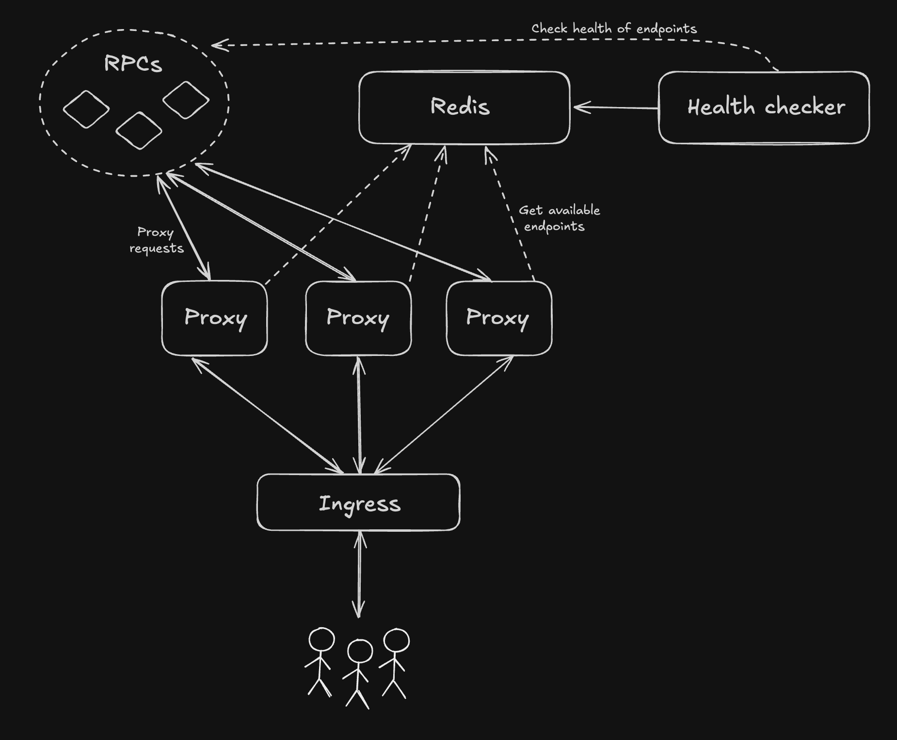

# Ætherlay - RPC Load Balancer

A lightweight, low-latency RPC load balancer written in Go. It is designed to manage and distribute requests to multiple upstream RPC endpoints based on their health status and request counts. The load balancer supports health checks and utilizes Redis for state management.

## Features

- **Round-Robin Load Balancing**: Distributes requests to available endpoints in a round-robin manner, prioritizing those with fewer requests in the last 24 hours.
- **Health Checks**: Regularly checks the health of upstream endpoints and updates their status in Redis.
- **Standalone Health Checker**: Optional standalone health checker service for efficient multi-pod deployments.
- **Static Configuration**: Loads RPC endpoint configurations from a static JSON file.
- **Multi-threaded**: Capable of handling multiple requests concurrently.
- **Kubernetes Ready**: Designed to run in a Kubernetes environment with Horizontal Pod Autoscaling (HPA) enabled.
- **WebSocket Support**: Full WebSocket proxy support for real-time applications.

## Setup Instructions

### Option 1: Integrated Health Checks

1. **Clone the Repository**:
   ```
   git clone https://github.com/project-aethermesh/aetherlay
   cd aetherlay
   ```

2. **Install Dependencies**:
   ```
   go mod tidy
   ```

3. **Configure Endpoints**:
   Rename the `configs/endpoints-example.json` file to `configs/endpoints.json` and modify it as required in order to add all the RPC endpoints you want to load balance with this tool.

4. **Set up your .env file**:
   Copy the `.env.example` file to `.env` and modify it as required:
   ```bash
   cp .env.example .env
   ```
   Edit the `.env` file to add your API keys and configuration. For running a single service with both the health check and load balancer, make sure to set `STANDALONE_HEALTH_CHECKS=false`.

5. **Run the Application**:
   ```
   make run-lb
   ```

### Option 2: Standalone Health Checker

1. **Clone the Repository**:
   ```
   git clone https://github.com/project-aethermesh/aetherlay
   cd aetherlay
   ```

2. **Install Dependencies**:
   ```
   go mod tidy
   ```

3. **Configure Endpoints**:
   Rename the `configs/endpoints-example.json` file to `configs/endpoints.json` and modify it as required in order to add all the RPC endpoints you want to load balance with this tool.

4. **Set up your .env file**:
   Copy the `.env.example` file to `.env` and modify it as required:
   ```bash
   cp .env.example .env
   ```
   Edit the `.env` file to add your API keys and configuration.

5. **Build and run both services in the background**:
   ```bash
   make run
   ```

### Option 3: Deploy to Kubernetes

Basic YAML files are provided for deploying to Kubernetes. It's recommended to check them out and update them as required. After that's done, simply run:
```bash
make k8s-deploy
```

## Usage

The load balancer will listen for incoming requests on predefined endpoints that match the configured chains (e.g., `/mainnet`, `/base`, `/optimism`). It will proxy these requests to the available upstream endpoints based on their health status and request counts.

### Available Endpoints

- `GET /health` - Health check endpoint for the load balancer
- `GET /{chain}` - WebSocket upgrade requests for a specific chain
- `POST /{chain}` - HTTP RPC requests for a specific chain

### Query Parameters

- `?archive=true` - Request archive node endpoints only

## Health Check Configuration

### Environment Variables

| Variable | Default | Description |
|----------|---------|-------------|
| `ALCHEMY_API_KEY` | - | API key for Alchemy RPC endpoints |
| `INFURA_API_KEY` | - | API key for Infura RPC endpoints |
| `REDIS_HOST` | `localhost` | Redis server hostname |
| `REDIS_PORT` | `6379` | Redis server port |
| `REDIS_PASS` | - | Redis server password (optional) |
| `HEALTH_CHECK_INTERVAL` | `30` | Health check interval in seconds |
| `STANDALONE_HEALTH_CHECKS` | `true` | Enable/disable the standalone mode of the health checker |
| `ZEROLOG_LEVEL` | `info` | Set the log level for zerolog |

### Integrated Health Checks

When `STANDALONE_HEALTH_CHECKS=false`, the load balancer will run integrated health checks using the `HEALTH_CHECK_INTERVAL` setting.

You can also disable health checks altogether by setting `HEALTH_CHECK_INTERVAL` to `0`, which might affect the performance of the proxy but will prevent the service from wasting your RPC credits by constantly running health checks. In this case, health checks will be run in an ad-hoc fashion. For example:
1. A user sends a request.
2. The LB tries to proxy that request to RPC endpoint "A" but fails.
3. 3 things happen at the same time:
   I. The RPC endpoint "A" is marked as unhealthy.
   II. The LB tries to proxy that request to another RPC endpoint.
   III. An ephemeral health checker starts running to monitor RPC endpoint "A".
4. As soon as RPC endpoint "A" is healthy again, the ephemeral health checker is stopped.

### Standalone Health Checker (Recommended)

For production deployments with multiple load balancer pods, use the standalone health checker:

- **Single Health Checker Instance**: Prevents duplicate health checks
- **Multiple Load Balancer Pods**: Scale independently without health check overhead
- **Resource Efficiency**: Reduces RPC endpoint usage
- **Better Separation of Concerns**: Health monitoring isolated from request handling

## Architecture Options

### Option 1: Integrated Health Checks


### Option 2: Standalone Health Checker (Recommended)



## Contributing

Contributions are welcome! Please submit a pull request or open an issue for any enhancements or bug fixes.

## License

This project is licensed under the Business Source License 1.1. See the LICENSE file for more details.

**Important**: This license allows free use for non-commercial purposes (personal use, educational purposes, non-profit organizations, open source projects, etc.) but requires a commercial license for commercial use. For commercial licensing inquiries, please send an email to [aetherlay@projectaethermesh.com](mailto:aetherlay@projectaethermesh.com).
